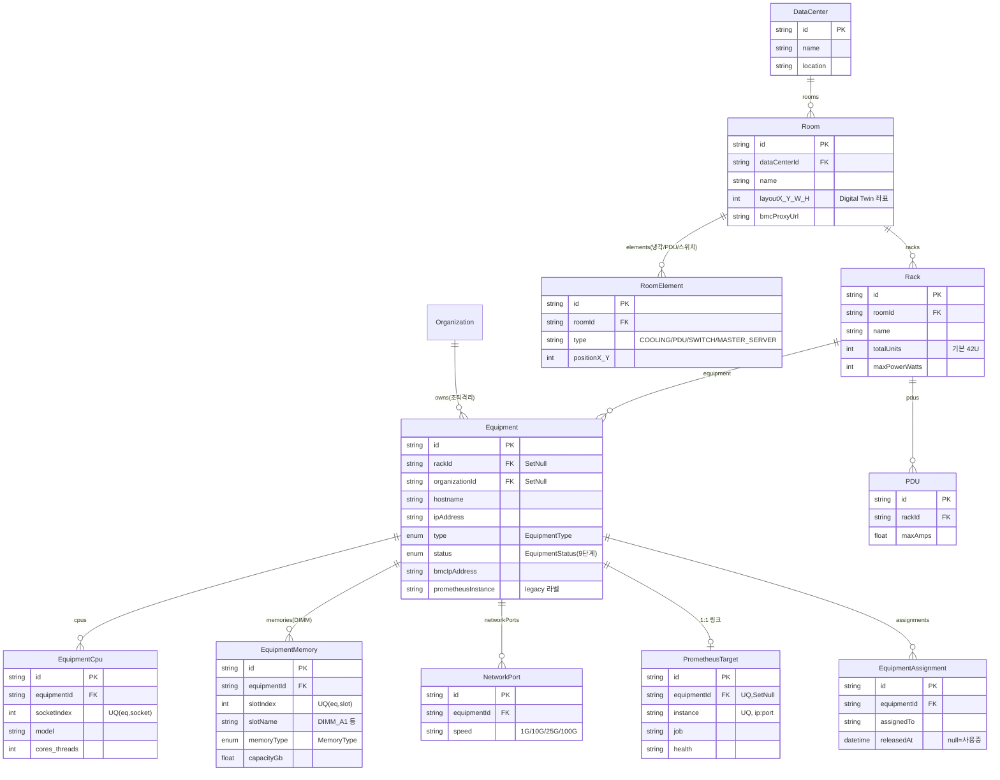
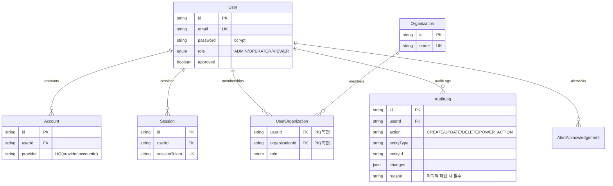
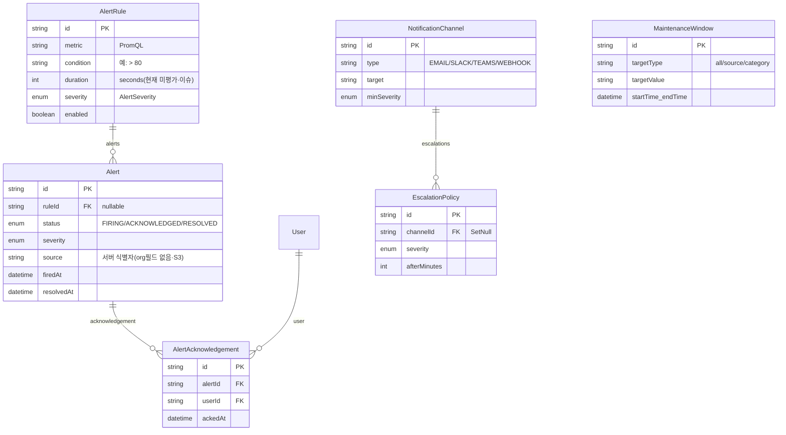
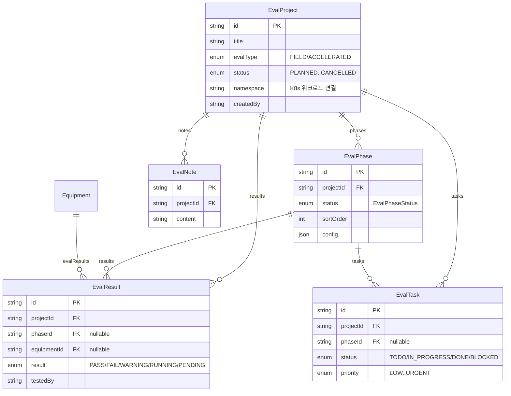

# 데이터 모델 ERD (DC Express — DCIM)

> `prisma/schema.prisma` 기준 (2026-07-02, 29개 모델 · 13개 enum). GitHub에서 Mermaid로 렌더된다.
> UML 범위(유즈케이스·액티비티·시퀀스)와 별개인 **데이터 모델링 산출물**이다.
> 필드 전체가 아니라 **PK/FK + 식별에 필요한 핵심 필드**만 표기했다. 전체 컬럼은 `schema.prisma` 참조.

---

## 1. 물리 계층 · 자산 (DataCenter → Room → Rack → Equipment)

---

## 2. 인증 · 조직 · 감사 (User / Organization / AuditLog)

---

## 3. 알림 · 알림 파이프라인 (AlertRule / Alert / 채널 / 에스컬레이션)

> **참고**: `MaintenanceWindow`는 FK 관계 없이 `targetType`/`targetValue`로 알림을 문자열 매칭 억제한다. `Alert`에 `organizationId`가 없어 조직별 필터가 불가(설계 허점 S3 → v1.0 이월, `docs/uml-diagrams.md §5`).

---

## 4. 메모리 평가 · 워크로드 (EvalProject 하위)

---

## 5. 독립 모델 · 참조 무결성 요약

| 모델 | 관계 | 비고 |
|------|------|------|
| `ExpiryTracker` | 관계 없음(독립) | 인증서·라이선스·보증 만료 추적. `source` 문자열로 대상 식별 |
| `MaintenanceWindow` | 관계 없음(독립) | 알림 억제 창. `targetType`/`targetValue` 문자열 매칭 |
| `AuditLog` | `User`만 FK | `entityType`/`entityId`로 임의 엔티티 참조(polymorphic, FK 아님) |

### onDelete 정책 (데이터 안전성)
- **Cascade**(부모 삭제 시 자식 삭제): Room→Rack/Element, Rack→PDU, Equipment→Cpu/Memory/NetworkPort/Assignment, EvalProject→Phase/Result/Task/Note, User→Account/Session/UserOrg, Alert→Acknowledgement
- **SetNull**(부모 삭제 시 FK만 null): Equipment.rackId, Equipment.organizationId, PrometheusTarget.equipmentId, EscalationPolicy.channelId
  - → 랙/조직/장비를 지워도 하위 레코드는 보존되고 링크만 끊긴다(자산 이력 보호).
- **명시 정책 없음(기본 제한)**: Alert.ruleId(nullable), EvalResult.phaseId/equipmentId(nullable) 등은 nullable로 두어 참조 대상 삭제와 무관하게 유지.

---

> 💡 스키마 변경 시 이 문서와 `docs/uml-diagrams.md`(권한 매트릭스), `docs/features.md`를 함께 갱신할 것.
