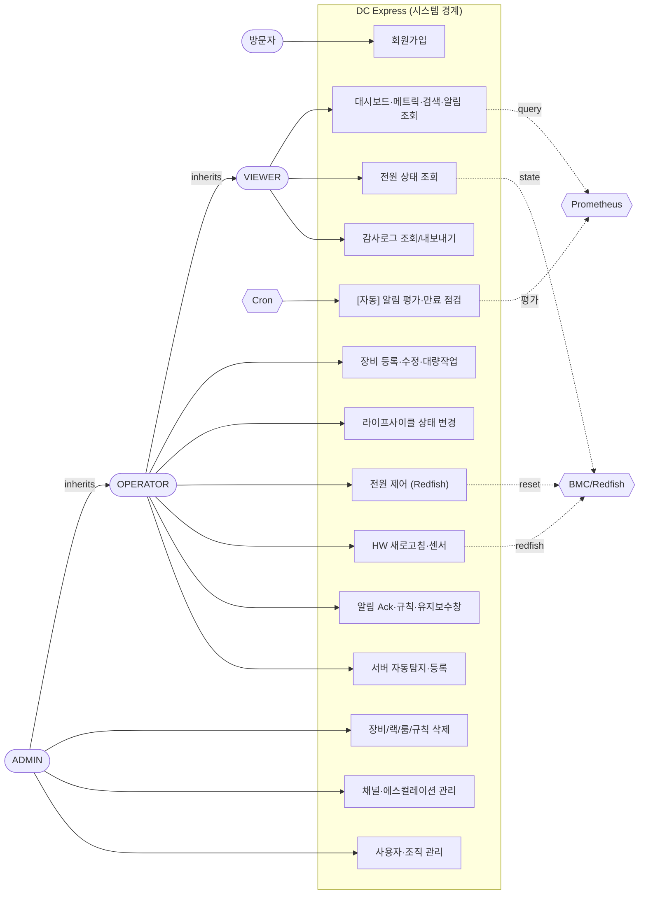
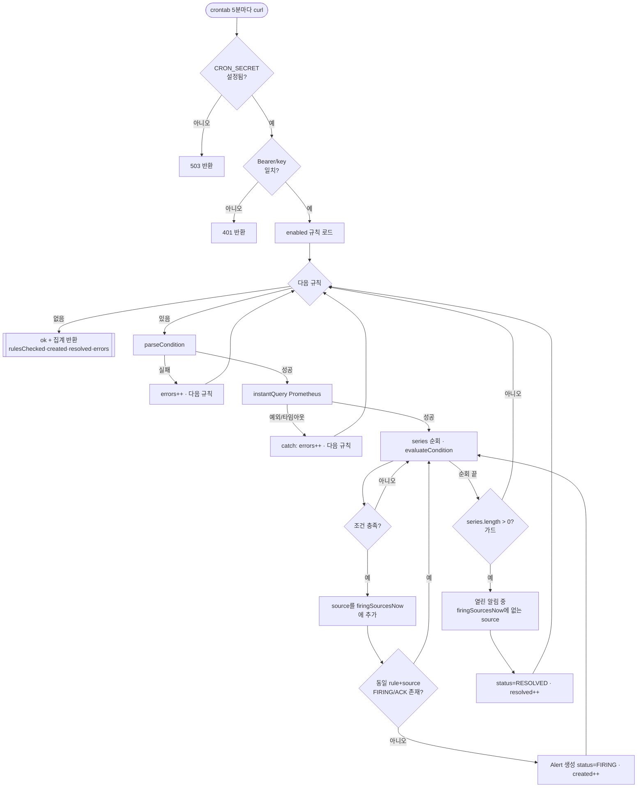
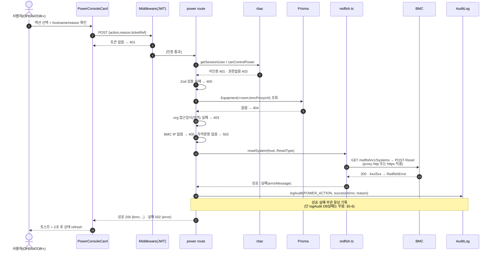
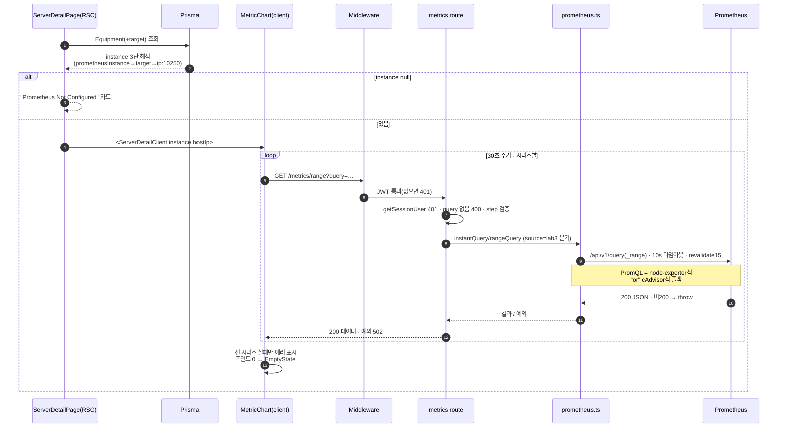

# UML 다이어그램 (DC Express — DCIM)

> 작성 2026-07-01. 실제 코드(파일:라인) 기반으로 도출. Mermaid 표기 → GitHub에서 자동 렌더링, 폐쇄망에선 코드블록 텍스트로 열람.
> 범위: **유즈케이스 · 액티비티 · 시퀀스**. 정적 구조는 [ARCHITECTURE.md](ARCHITECTURE.md)·[technical-data-flow.md](technical-data-flow.md) 참조(중복 회피).
> 이 문서를 그리며 발견한 **설계 허점**은 맨 아래 §5.

---

## 1. 유즈케이스 다이어그램

### 액터
| 액터 | 유형 | 설명 |
|------|------|------|
| 방문자 | 사람 | 미승인. 회원가입만 (`api/auth/signup`) |
| VIEWER | 사람 | 조회 위주 (기본 역할, `approved` 필요) |
| OPERATOR | 사람 | 편집·운영 (VIEWER 권한 포함) |
| ADMIN | 사람 | 전권 + 삭제·사용자/조직 관리 (org 필터 면제) |
| Cron 스케줄러 | 시스템 | `CRON_SECRET` 인증, 알림/만료 자동 평가 |
| Prometheus | 시스템(2차) | 메트릭 조회·타겟 동기화·인증서 수집 |
| BMC/Redfish | 시스템(2차) | 전원 제어·HW 정보·센서 |

역할 일반화: **ADMIN ⊃ OPERATOR ⊃ VIEWER** (상위 역할이 하위 권한 포함).

> 정밀 권한은 아래 매트릭스 참조(다이어그램은 "최소 필요 역할"만 연결, 상위 역할은 일반화로 상속).

### 역할–권한 매트릭스 (O=가능 · △=org 소속 조건 · X=불가)

| 유즈케이스 | ADMIN | OPERATOR | VIEWER | Cron | 근거 |
|-----------|:---:|:---:|:---:|:---:|------|
| 조회(대시보드·메트릭·검색·알림) | O | △ | △ | X | rbac 없음(인증만) |
| 장비 등록·수정·대량 | O | △ | X | X | `canEdit` |
| 장비 삭제 | O | X | X | X | `canDelete` |
| 상태 변경 | O | △ | X | X | `canChangeStatus` |
| 전원 제어 | O | △ | X | X | `canControlPower` |
| 전원 상태 조회 | O | △ | △ | X | 인증+org |
| 랙/룸 생성·수정 | O | O | X | X | `canEdit` |
| 랙/룸 삭제 | O | X | X | X | `canDelete` |
| 알림 Ack | O | O | X | X | `canAcknowledgeAlert` |
| 알림 규칙/유지보수창 생성·수정 | O | O | X | X | `canEdit` |
| 채널·에스컬레이션 관리 | O | X | X | X | `isAdmin` |
| 만료항목 CRUD(삭제 포함) | O | **O** | X | X | `canEdit` ⚠️ |
| 탐지 타겟 등록 / 해제 | O·O | O / **X** | X | X | 등록 canEdit·해제 admin ⚠️ |
| **평가 프로젝트 생성·수정** | O | O | **O** | X | 역할 체크 없음 🔴 |
| **장비 할당 생성·수정** | O | △ | **△** | X | 역할 체크 없음 🔴 |
| 사용자/조직 관리 | O | X | X | X | `canManageUsers` |
| 감사로그 조회 / 내보내기 | O·O | O / X | O / X | X | 조회 무제한·내보내기 admin ⚠️ |
| [자동] 알림 평가·만료 점검 | X | X | X | O | CRON_SECRET |

🔴/⚠️ = §5의 허점 후보.

---

## 2. 액티비티 다이어그램 — 알림 규칙 자동 평가 (cron)

`crontab → /api/cron/alert-check → runAlertCheck()` (`src/lib/alert-check.ts`).

**상태 전이**: `FIRING`(cron 생성) → `ACKNOWLEDGED`(사용자 Ack) → `RESOLVED`(cron 자동, 소스 해소). FIRING→RESOLVED 직행 가능.
**핵심 규칙(코드에만 있던 것)**: ① FIRING·ACK 존재 시 중복 생성 스킵, ② `series.length>0` 가드로 빈 응답 시 잘못된 일괄 해소(플래핑) 방지.

---

## 3. 시퀀스 다이어그램 — BMC 전원 제어

`POST /api/equipment/[id]/power` (`src/app/api/equipment/[id]/power/route.ts`).

---

## 4. 시퀀스 다이어그램 — 메트릭 조회 (node-exporter 우선 + cAdvisor 폴백)

서버 상세 차트 (`/api/metrics/instant|range` → `src/lib/prometheus.ts`).

---

## 5. 다이어그램을 그리며 발견한 설계 허점

> 유즈케이스·플로우를 코드로 추적하며 나온 **비대칭·누락·관측성** 이슈. 심각도순.
>
> **2026-07-02 조치**: 🔴 권한/보안 중 **S1·S2·S4·S5·S17 수정 완료**, **S3는 스키마 변경 필요라 v1.0로 이월**.
> S4는 "duration 7일 캡 + query 2000자 캡 + `Cache-Control: private`"로 경량 하드닝(팀A/B 결과 — 서버측 PromQL 화이트리스트 전면 도입은 프론트 13개 호출부 리팩터 필요라 v1.0 방어심화로 이월). 상세: CHANGELOG.

### 🔴 권한/보안 (우선)
| # | 허점 → 조치 | 근거 |
|---|------|------|
| S1 | ✅ **수정됨** — 평가·워크로드 쓰기 API 전체(POST/PATCH/DELETE)에 `canEdit` 가드(프로젝트 삭제는 `canDelete`) → VIEWER 쓰기 차단 | `api/evaluations/**`, `workloads/[namespace]` |
| S2 | ✅ **수정됨** — 장비 할당 POST/PATCH에 `canEdit` 가드(org 검사와 병행) | `equipment/[id]/assignments/route.ts` |
| S3 | ⏳ **v1.0 이월** — `Alert`·`AlertRule`에 organizationId 없음 → 스키마 마이그레이션 + source→equipment 매핑 필요 | `api/alerts/route.ts` GET |
| S4 | ✅ **수정됨(경량 하드닝)** — range duration 7일 캡·query 2000자 캡·`Cache-Control: private`. 화이트리스트는 v1.0 | `metrics/instant·range/route.ts` |
| S5 | ✅ **수정됨** — Bearer 헤더만 허용(`?key=` 제거)·`timingSafeEqual`. 공통 헬퍼 `lib/cron-auth.ts` | `cron/*/route.ts` |

### ⚠️ 권한 비대칭 (정합성)
| # | 허점 | 근거 |
|---|------|------|
| S6 | 삭제 권한 불일치: 대부분 ADMIN인데 **만료항목 삭제는 OPERATOR** 가능 | `expiry-tracker/[id]/route.ts:70` |
| S7 | Discovery **등록은 OPERATOR·해제는 ADMIN** (등록해도 되돌리지 못함) | `discovery/register:77` vs `unregister:11` |
| S8 | 감사로그 **조회는 전원·내보내기는 ADMIN** (동일 데이터 비대칭) | `audit-logs/route.ts:8` vs `export/route.ts:10` |
| S9 | 가드 스타일 이원화 + `requireAuth`/`requireRole` **dead code**(사용처 0) → 드리프트 위험 | `rbac.ts:11-25` |

### 🟡 운영/정합성 (알림 엔진·감사)
| # | 허점 | 근거 |
|---|------|------|
| S10 | 알림 평가 **에러 전부 무음**(`catch{} errors++`만, 로그 없음) → 어떤 규칙이 왜 실패했는지 추적 불가 | `alert-check.ts:98-100` |
| S11 | **잘못된 condition(예: `=>`, float `==`)이 에러 아닌 "영원히 안 울리는 규칙"으로** 조용히 방치 | `alert-check.ts:12,23-26` |
| S12 | 자동해소 가드가 **완전 빈 응답만** 방지 → **부분 scrape gap**엔 여전히 플래핑 여지 | `alert-check.ts:84` |
| S13 | source 폴백 `"unknown"` 충돌 → 라벨 없는 서로 다른 시리즈가 합쳐져 정당한 알림 스킵 | `alert-check.ts:56` |
| S14 | **감사로그 write 실패 무시** vs "Always recorded" 주석 불일치 → 감사 없이 전원 액션 성공 가능(write-audit-first 아님) | `power/route.ts:100` vs `audit.ts:73-76` |
| S15 | 전원 **GET은 실패도 200+error**(POST는 4xx/5xx) → 모니터링이 실패를 성공으로 집계 | `power/route.ts:66-94` |
| S16 | BMC 자격증명 **proxy 경유 시 http(평문) + 전 함대 단일 admin 계정** → 유출 시 폭발반경 큼 | `redfish.ts:63-104`, `bmc-credentials.ts:32-43` |
| S17 | ✅ **수정됨** — 메트릭 응답 `Cache-Control: public`→`private`(S4와 함께) | `metrics/instant·range/route.ts` |
| S18 | 차트 **부분 실패 무시**(전 시리즈 실패만 에러) → 1개 시리즈 계속 502여도 사용자는 "선 하나 없음"만 봄 | `metric-chart.tsx:149-156` |
| S19 | 알림 평가 **N+1 쿼리**(규칙×시리즈마다 findFirst) → 규모 증가 시 cron 1회 수백 쿼리 | `alert-check.ts:61,85` |

> 대부분 "동작은 하지만 경계/관측성이 약한" 것들. **S1~S4(권한 우회)는 지난 org-정책 버그와 동류**라 v1.0에서 우선 처리 권장. 상세 근거는 각 file:line.
